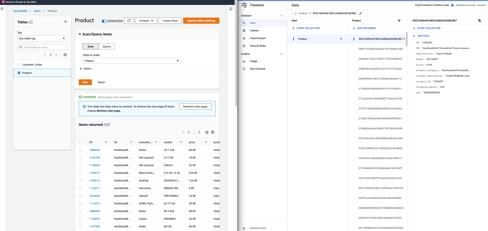

## Configuring AWS access

If you haven't installed AWS CLI, you can follow [the steps](../copy-data/README.md#configuring-aws-access) here to install it.

## Creating the source tables in DynamoDB:

1. Create a Python [virtual environment](https://docs.python.org/3/library/venv.html).

    ```bash
    python3 -mvenv venv
    ```

1. Activate the virtual environment.

    ```bash
    source venv/bin/activate
    ```

1. Install the required Python modules.

    ```bash
    pip install -r requirements.txt
    ```

1. Run the following commands will create two DynamoDB tables: `Product` and `Customer_Order`.

    ```bash
    python create_customer_order.py

    python create_product.py
    ```

1. Add data to both tables:

    ```bash
    python put_customer_order_items.py

    python put_product_items.py
    ```

1. Enable streaming for the tables:

    ```bash
    aws dynamodb update-table --table-name Product \
          --stream-specification \
          StreamEnabled=true,StreamViewType=NEW_AND_OLD_IMAGES

    aws dynamodb update-table --table-name Customer_Order\
          --stream-specification \
          StreamEnabled=true,StreamViewType=NEW_AND_OLD_IMAGES

    ```

## Copying data from DynamoDB to Firestore

1. Copy the data from the `Product` table to Firestore.

    ```bash
    python ../copy-data/cp_ddb_firestore.py Product
    ```

1. You should have output similar to the following.

        DDB PK -> Firestore ID
        1086676 -> 52522c6728e75f32c3c414b89397f193
        1145709 -> b2c516a79b4c616ef58d3e24726bed82
        ......
        Total items read from DynamoDB: 1006
        Total items written to Firestore: 1006

    After it's done, the data have been copied over to Firestore. You can view the results like the following if you open the `Product` table in the [DynamoDB console](https://console.aws.amazon.com/dynamodbv2/home?r#tables) and [Firestore console data page](https://console.cloud.google.com/firestore/data).
    

## Streaming changes from DynamoDB to Firestore

1. Change to the `cdk` directory.

    ```bash
    cd ../streaming-replication/cdk
    ```
1. Set up the variables. This time you use the `Customer_Order` table. Remember to use your project ID for `GCP_PROJECT_ID` variable.

    ```bash
    export AWS_REGION=us-east-1
    export AWS_ACCOUNT_ID=$(aws sts get-caller-identity --query Account --output text)
    export DYNAMODB_TABLE=Customer_Order
    export GCP_PROJECT_ID=[Your GCP Project ID]
    export APP_NAME=ddb-firestore-sync-app
    export AWS_SECRET_NAME=ddb2firestore/gcp-sa-key-example
    ```
1. Create a service account on GCP and download the key file.

    ```bash
    gcloud iam service-accounts create ddb-fs-sa-example \
        --description="SA used to copy records from AWS to GCP" \
        --display-name="ddb-fs-sa-example"

    gcloud projects add-iam-policy-binding $GCP_PROJECT_ID \
    --member="serviceAccount:ddb-fs-sa-example@$GCP_PROJECT_ID.iam.gserviceaccount.com" \
        --role="roles/datastore.user"

    gcloud iam service-accounts keys create gcp-key.json \
        --iam-account=ddb-fs-sa-example@$GCP_PROJECT_ID.iam.gserviceaccount.com
    ```

1. Create a secret in AWS secrets manager for the GCP service account key file:

    ```bash
    aws secretsmanager create-secret --name $AWS_SECRET_NAME \
    --description "Access GCP firestore" --secret-string $(base64 gcp-key.json)
    ```

1. Get the secret ARN.

    ```bash
    export SECRET_ARN=$(aws secretsmanager describe-secret --secret-id $AWS_SECRET_NAME --query 'ARN' | tr -d '"')
    ```

1. If it's the first time you use CDK for the AWS account, you need to use bootstrap to initialize CDK.

    ```bash
    cdk bootstrap
    ```

1. Deploy the change.

    ```bash
    cdk deploy
    ```

1. If everything setup correctly, you should have successful deployment similar to the following.

    ```
    ✅  DynamodbFirestoreStack

    ✨  Deployment time: 120.11s

    Stack ARN:
    arn:aws:cloudformation:us-east-1:111111111111:stack/DynamodbFirestoreStack/c03bd210-7c70-11ec-8b98-121d2604b04f

    ✨  Total time: 131.44s
    ```

1. You can now make changes in the DynamoDB table `Customer_Order` and verify the changes have been replicated in Firestore. The following screencast is an example.

    

## Cleaning up

1. Delete the AWS resources including the Lambda function.

    ```bash
    cdk destroy
    ```

1. Delete the GCP service account.

    ```bash
    gcloud iam service-accounts delete \
        dynamodb-firestore-sa@$GCP_PROJECT_ID.iam.gserviceaccount.com
    ```
